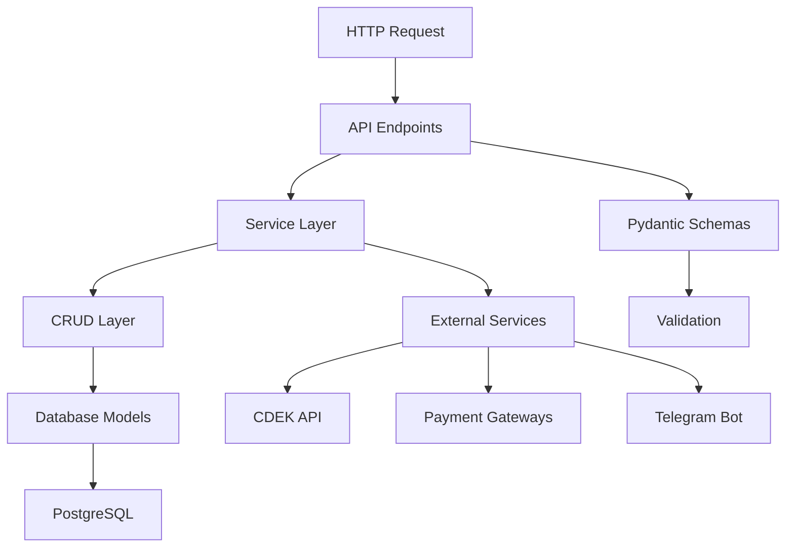

# Архитектура Backend приложения

## Обзор

Backend приложения построен на основе **FastAPI** фреймворка с использованием **многослойной архитектуры** (Layered Architecture). Приложение следует принципам **Clean Architecture** и разделения ответственности.

## Структура проекта

```
backend/
├── alembic/                    # Миграции базы данных
├── app/                        # Основной код приложения
│   ├── api/                    # API слой
│   ├── core/                   # Ядро приложения
│   ├── crud/                   # Слой доступа к данным
│   ├── models/                 # Модели данных (SQLAlchemy)
│   ├── schemas/                # Схемы данных (Pydantic)
│   ├── services/              # Бизнес-логика
│   ├── utils/                 # Утилиты
│   └── main.py                # Точка входа
├── tests/                     # Тесты
└── scripts/                   # Скрипты
```

## Слои архитектуры

### 1. Слой представления (Presentation Layer) - `app/api/`

**Назначение**: Обработка HTTP запросов, валидация входных данных, формирование ответов.

**Компоненты**:
- **Endpoints** (`app/api/v1/endpoints/`) - REST API эндпоинты
- **Router** (`app/api/v1/router.py`) - маршрутизация запросов
- **Dependencies** (`app/api/deps.py`) - зависимости FastAPI
- **Middleware** (`app/api/middleware.py`) - промежуточное ПО

**Основные файлы**:
- `auth.py` - аутентификация и авторизация
- `products.py` - управление товарами
- `cart.py` - работа с корзиной
- `orders.py` - управление заказами
- `payment.py` - обработка платежей
- `admin.py` - административные функции

**Принципы**:
- Тонкий слой, содержит только логику HTTP
- Не содержит бизнес-логику
- Делегирует выполнение бизнес-операций сервисному слою

### 2. Сервисный слой (Service Layer) - `app/services/`

**Назначение**: Реализация бизнес-логики приложения.

**Структура**:
```
services/
├── cart/                      # Логика корзины
│   ├── cart_service.py
│   └── reservation_service.py
├── category/                  # Управление категориями
├── cdek/                      # Интеграция с CDEK
├── export/                    # Экспорт данных
├── order/                     # Обработка заказов
├── payment/                   # Платежная логика
├── product/                   # Управление товарами
├── profile/                   # Профили пользователей
├── referral/                  # Реферальная система
├── scheduler/                 # Планировщик задач
└── telegram/                  # Telegram бот
```

**Пример сервиса** (`CartService`):
```python
class CartService:
    def __init__(self, cart_crud: CartCRUD, product_crud: ProductCRUD):
        self.cart_crud = cart_crud
        self.product_crud = product_crud
        self.reservation_service = ReservationService(product_crud)

    async def add_to_cart(self, user_id: UUID, data: SAddToCart) -> Cart:
        # Бизнес-логика добавления товара в корзину
        # Валидация, проверка наличия, резервирование
```

**Принципы**:
- Содержит всю бизнес-логику
- Координирует работу CRUD слоя
- Обеспечивает транзакционность операций
- Не зависит от деталей HTTP

### 3. Слой доступа к данным (Data Access Layer) - `app/crud/`

**Назначение**: Абстракция над операциями с базой данных.

**Основные CRUD классы**:
- `ProductCRUD` - операции с товарами
- `CartCRUD` - операции с корзиной
- `OrderCRUD` - операции с заказами
- `UserCRUD` - операции с пользователями
- `PaymentCRUD` - операции с платежами

**Пример CRUD класса**:
```python
class ProductCRUD:
    def __init__(self, session: AsyncSession):
        self.session = session
    
    async def get_products(self, skip: int = 0, limit: int = 10) -> Tuple[List[Product], int]:
        # Операции с базой данных
        query = select(Product).where(Product.is_active == True)
        # ...
```

**Принципы**:
- Инкапсуляция SQL запросов
- Работа с SQLAlchemy моделями
- Обработка операций CRUD (Create, Read, Update, Delete)
- Реализация паттерна Repository

### 4. Модели данных (Data Models) - `app/models/`

**Назначение**: Определение структуры данных и связей между сущностями.

**Основные модели**:
- `Product` - товары
- `Cart` - корзина
- `Order` - заказы
- `User` - пользователи
- `Payment` - платежи
- `Category` - категории

**Базовая модель**:
```python
@as_declarative()
class Base:
    id: Any
    __name__: str
    
    created_at = Column(DateTime(timezone=True), server_default=func.now())
    updated_at = Column(DateTime(timezone=True), onupdate=func.now())
```

**Принципы**:
- SQLAlchemy ORM модели
- Автоматические timestamps
- Связи между таблицами
- UUID как первичные ключи

### 5. Схемы данных (Data Schemas) - `app/schemas/`

**Назначение**: Валидация и сериализация данных API.

**Типы схем**:
- `BaseModel` - базовые поля
- `CreateModel` - для создания объектов
- `UpdateModel` - для обновления объектов
- `ResponseModel` - для ответов API

**Пример схемы**:
```python
class SProductBase(BaseModel):
    name: str = Field(..., min_length=1, max_length=255)
    price: condecimal(decimal_places=2, gt=0)
    stock: int = Field(0, ge=0)
    
class SProductCreate(SProductBase):
    pass
    
class SProduct(SProductBase):
    id: UUID
    created_at: datetime
    updated_at: datetime
```

**Принципы**:
- Pydantic валидация
- Автоматическая сериализация/десериализация
- Документация OpenAPI
- Типизация данных

### 6. Ядро приложения (Core) - `app/core/`

**Назначение**: Базовая конфигурация и инфраструктурные компоненты.

**Компоненты**:
- `settings.py` - конфигурация приложения
- `db.py` - подключение к базе данных
- `logger.py` - логирование
- `redis.py` - подключение к Redis
- `exceptions.py` - базовые исключения

**Принципы**:
- Централизованная конфигурация
- Инжекция зависимостей
- Инициализация ресурсов

### 7. Утилиты (Utils) - `app/utils/`

**Назначение**: Вспомогательные функции и классы.

**Компоненты**:
- `cache.py` - кеширование
- `security.py` - безопасность
- `validators.py` - валидаторы
- `json_serializer.py` - сериализация JSON

## Взаимодействие слоев



## Принципы архитектуры

### 1. Разделение ответственности
- Каждый слой имеет четко определенную ответственность
- Слои не смешивают логику разных уровней абстракции

### 2. Инверсия зависимостей
- Высокоуровневые модули не зависят от низкоуровневых
- Зависимости инжектируются через FastAPI Depends

### 3. Чистая архитектура
- Бизнес-логика изолирована от внешних зависимостей
- Легкость тестирования и поддержки

### 4. Асинхронность
- Использование async/await для всех I/O операций
- AsyncSession для работы с базой данных

## Обработка запросов

### Типичный flow обработки запроса:

1. **HTTP Request** → API Endpoint
2. **Validation** → Pydantic Schema
3. **Authentication** → Dependencies
4. **Business Logic** → Service Layer
5. **Data Access** → CRUD Layer
6. **Database** → SQLAlchemy Models
7. **Response** → Pydantic Schema → JSON

### Пример полного цикла (добавление товара в корзину):

```python
# 1. API Endpoint
@router.post("/add")
async def add_to_cart(
    data: SAddToCart,  # 2. Validation
    user: User = Depends(get_current_user),  # 3. Authentication
    cart_service: CartService = Depends(get_cart_service)  # DI
):
    # 4. Business Logic
    cart = await cart_service.add_to_cart(user.id, data)
    return cart

# 5. Service Layer
async def add_to_cart(self, user_id: UUID, data: SAddToCart) -> Cart:
    # Бизнес-логика: валидация, проверки, резервирование
    cart = await self.cart_crud.add_product(...)  # 6. CRUD
    return cart

# 7. CRUD Layer
async def add_product(self, cart_id: UUID, product_id: UUID, quantity: int):
    # SQL операции через SQLAlchemy
    query = update(Cart).where(...)
    await self.session.execute(query)
```

## Миграции базы данных

**Alembic** используется для управления миграциями:
- Автоматическая генерация миграций
- Версионность схемы базы данных
- Откат изменений

## Тестирование

**Структура тестов**:
```
tests/
├── conftest.py           # Конфигурация тестов
├── test_api/            # Тесты API endpoints
└── test_services/       # Тесты сервисного слоя
```

## Логирование и мониторинг

- **Структурированное логирование** с дополнительной информацией
- **Централизованный logger** в `app/core/logger.py`
- **Трассировка запросов** через middleware
- **Health checks** для мониторинга

## Безопасность

- **Telegram WebApp** аутентификация
- **Роли пользователей** (admin, user)
- **Валидация данных** на всех уровнях
- **CORS** настройки
- **Exception handling** для безопасности данных

## Расширяемость

Архитектура позволяет легко:
- Добавлять новые endpoints
- Расширять бизнес-логику
- Интегрировать внешние сервисы
- Изменять способы хранения данных
- Добавлять новые типы пользователей и ролей
