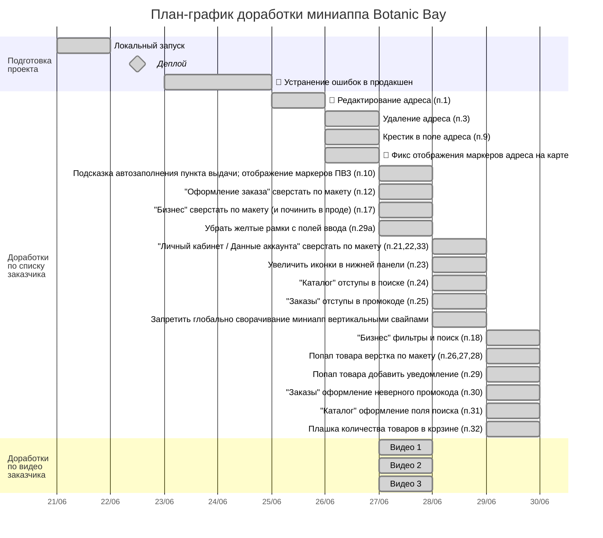

## График доработок по первому списку правок от заказчика

- Период работ с 21 по 29 июня (включительно).
- Общие затраты времени:  24,3 ч.

🔴 – пункты, где потребовались значительные доработки кроме указанных заказчиком правок.

## Статистика по правкам от заказчика (номера пунктов)

- ✅ Сделал: 1, 3, 9, 10, 12, 17, 18, 21, 22, 23, 24, 25, 26, 27, 28, 29, 29a, 30, 31, 32, 33; видео 1, 2, 3
- ⏳ Запланировал: 8, видео 4 (поиск адреса доставки и ПВЗ)
- ❓ Задал вопросы: 8, 19, видео 4
- ℹ️✅ Инфо от Тимофея: 2, 4, 5, 6, 7, 11, 20 - вот эти правки сделаны
- ❌ Пункты, связанные с банковскими картами (не делаем): 13, 14, 15, 16