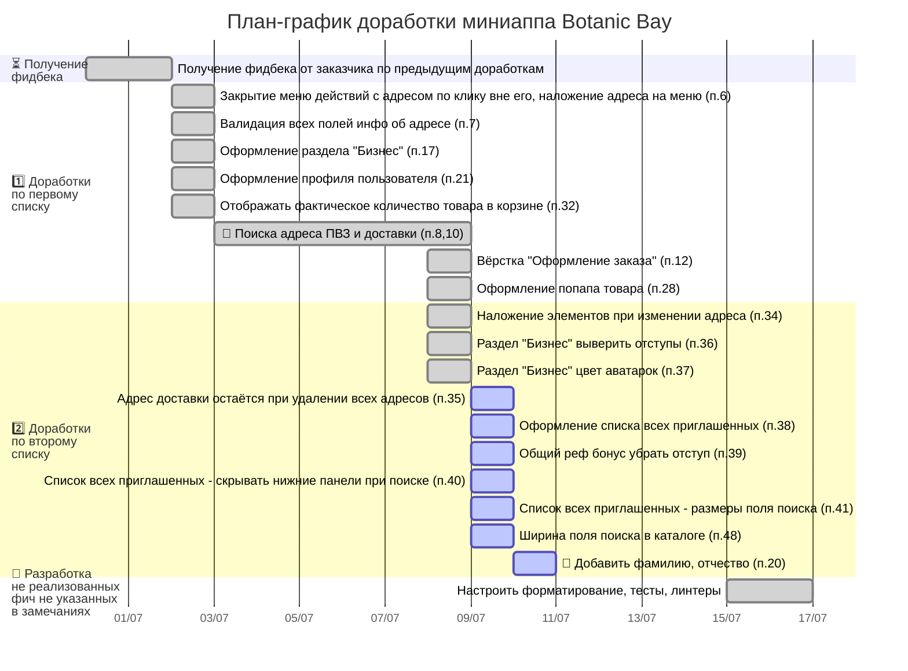

## График доработок по второму списку правок от заказчика

- Период работ с 30 июня по 20 июля включительно.
- Общие затраты времени:  5,5+ ч.

🔴 – пункты, где потребовались значительные доработки кроме указанных заказчиком правок.

## Статистика по правкам от заказчика (номера пунктов)

- ✅ Сделал: 6, 7, 8, 10, 12, 28 17, 21, 32, 36, 37
- ⏳ Запланировал: 20, 34, 35, 38, 39, 40, 41, 48
- ❓ Задал вопросы: 19, 42, 47
- ⏳ Ждём макет от заказчика: 29

## Частично реализованные фичи, требующие значительной доработки

- 🟡 Оформление заказов (готовность ≈90%)
- 🟡 Оплата заказов (готовность ≈90: не работает)
- 🟡 Интеграция со СДЭК (готовность ≈70%):
    - нет вебхуков для СДЭК
    - хардкод тарифа, адреса, веса, телефона при создании заказа
    - нет отслеживания заказа
    - нет интеграции со складом
- 🟡 Реферальная система (готовность ≈80%: на фронте только заглушки вместо реальной информации)
- 🟡 Админка (готовность ≈30%)

## Полностью не реализованные фичи

- 🔴 Интеграция с API склада для синхронизации товарных остатков
- 🔴 Система промокодов